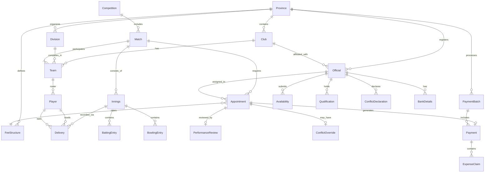
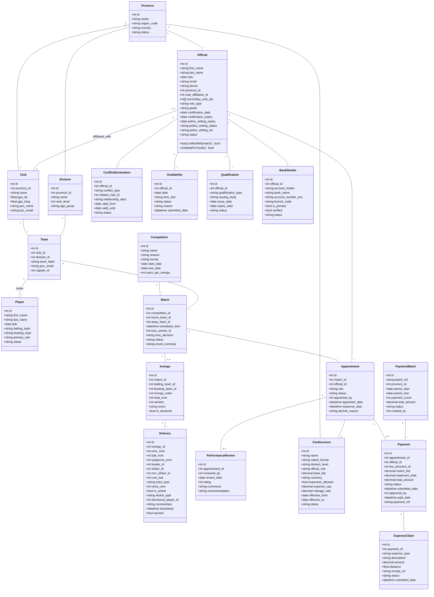

# **Software Requirements Specification (SRS)**

## **Project: Cricket Match Management PWA**

**Version:** 1.5
**Last Updated:** 2026-01-31
**Status:** Draft

---

### **Document History**

| Version | Date       | Author | Changes                          |
|---------|------------|--------|----------------------------------|
| 1.0     | -          | -      | Initial draft                    |
| 1.1     | 2026-01-31 | -      | Gap analysis and corrections     |
| 1.2     | 2026-01-31 | -      | Added Officials Management section |
| 1.3     | 2026-01-31 | -      | Added Officials Payment & Expenses |
| 1.4     | 2026-01-31 | -      | Added Police Vetting & Safeguarding |
| 1.5     | 2026-01-31 | -      | Added Scoring Engine Technical Spec |

---

### **1. Introduction**

#### **1.1 Purpose**

The objective of this project is to develop a Progressive Web Application (PWA) to streamline the administration of cricket matches. The system will manage hierarchies from provincial bodies down to individual club teams, coordinate officials, and provide a robust real-time ball-by-ball scoring engine.

#### **1.2 Scope**

The system covers:
- Administrative hierarchy management (Province → Club → Division → Team)
- Personnel management (Players, Officials, Coaches)
- Tournament and match scheduling
- Real-time ball-by-ball scoring with offline capability
- Live scorecard viewing for public users
- Statistics and reporting

**Out of Scope:**
- Ticket sales and venue management
- Broadcasting/streaming integration
- Financial management

#### **1.3 Definitions and Glossary**

| Term | Definition |
|------|------------|
| PWA | Progressive Web Application |
| Innings | A team's turn to bat |
| Over | A set of 6 legal deliveries bowled by one bowler |
| Extras | Runs not credited to any batter (wides, no-balls, byes, leg-byes, penalty runs) |
| DLS | Duckworth-Lewis-Stern method for rain-affected matches |
| Powerplay | Fielding restriction periods in limited-overs cricket |
| DRS | Decision Review System |
| Follow-on | When a team bats again immediately after their first innings (multi-day matches) |

#### **1.4 Assumptions**

- Users have access to modern web browsers (Chrome, Firefox, Safari, Edge)
- Scorers have basic cricket knowledge
- Internet connectivity may be intermittent at venues
- GPS functionality is available on scorer devices

#### **1.5 Constraints**

- Must function offline for extended periods (6+ hours)
- Must support low-bandwidth environments
- Battery consumption must be minimized for mobile devices

---

### **2. Organizational Model & Data Requirements**

The system must support the following data entities and their specific attributes:

#### **2.1 Administration Hierarchy**

* **Province:**
  - Name
  - Region Code
  - Country
  - Contact Person (Name, Email, Phone)
  - Status (Active/Inactive)

* **Club:**
  - Name
  - Province (FK)
  - Home Ground Address
  - GPS Location (Latitude, Longitude)
  - Ground Capacity
  - Facilities Available
  - Club POC (Name, Email, Phone)
  - Logo/Crest (Image URL)
  - Status (Active/Inactive)

* **Division:**
  - Name
  - Rank Level (e.g., Premier, Division 1, Division 2)
  - Province (FK)
  - Age Group (Senior, U19, U15, etc.)
  - Gender (Men/Women/Mixed)

* **Team:**
  - Label (e.g., 1st XI, 2nd XI)
  - Club (FK)
  - Primary Division (FK)
  - Team POC (Name, Email, Phone)
  - Captain (Player FK)
  - Vice-Captain (Player FK)
  - Maximum Squad Size
  - Status (Active/Inactive)

#### **2.2 Personnel**

* **Players:**
  - Name (First, Last)
  - Date of Birth
  - Photo URL
  - Contact (Email, Phone)
  - Jersey Number
  - Batting Style (Right-hand, Left-hand)
  - Bowling Style (Right-arm Fast, Left-arm Spin, etc.)
  - Primary Role (Batter, Bowler, All-rounder, Wicket-keeper)
  - Team History (with join/leave dates)
  - Playing Status (Active, Injured, Retired, Unavailable)
  - Unique Registration ID

* **Match Officials:**
  - Umpires:
    - Name
    - Grade/Certification Level
    - Contact (Email, Phone)
    - Certification Date
    - Province (FK)
    - Availability Status
  - Scorers:
    - Name
    - Contact (Email, Phone)
    - Certification Level
    - Province (FK)
  - Match Referees:
    - Name
    - Grade
    - Contact (Email, Phone)

* **Support Staff (Optional):**
  - Coaches (Name, Role, Contact)
  - Team Managers (Name, Contact)
  - Physiotherapists

#### **2.3 Tournament & Match Data**

* **Competition/Tournament:**
  - Name
  - Season/Year
  - Format (T20, ODI/List A, Multi-day/First-class)
  - Start Date
  - End Date
  - Province (FK) or National
  - Division (FK)
  - Participating Teams
  - Rules/Regulations URL
  - Overs per Innings (for limited-overs)
  - Powerplay Rules (overs and fielding restrictions)
  - Points System (Win/Loss/Draw/Tie/NR points)
  - Status (Upcoming, In Progress, Completed)

* **Match:**
  - Competition (FK)
  - Match Number/Round
  - Home Team (FK)
  - Away Team (FK)
  - Date and Scheduled Start Time
  - Venue/Ground (Club FK)
  - Toss Winner (Team FK)
  - Toss Decision (Bat/Field)
  - Umpire 1 (FK)
  - Umpire 2 (FK)
  - Third Umpire (FK, optional)
  - Match Referee (FK, optional)
  - Scorer(s) (FK)
  - Weather Conditions
  - Pitch Report
  - Match Status (Scheduled, In Progress, Completed, Abandoned, No Result)
  - Result Summary
  - Player of the Match (Player FK)
  - DLS Target (if applicable)
  - Last Synced Timestamp

* **Innings:**
  - Match (FK)
  - Batting Team (FK)
  - Bowling Team (FK)
  - Innings Order (1st, 2nd, 3rd, 4th for multi-day)
  - Total Runs
  - Wickets Lost
  - Overs Bowled (overs.balls format)
  - Extras Breakdown:
    - Wides
    - No-balls
    - Byes
    - Leg-byes
    - Penalty Runs
  - Target Score (for 2nd+ innings)
  - Declaration (boolean, for multi-day)
  - Follow-on Enforced (boolean)
  - Current Run Rate
  - Required Run Rate (chase scenarios)
  - Status (Not Started, In Progress, Completed)

* **Delivery (Ball-by-Ball):**
  - Innings (FK)
  - Over Number
  - Ball Number (within over, 1-6 for legal deliveries)
  - Sequence Number (absolute position including extras)
  - Bowler (Player FK)
  - Striker (Player FK)
  - Non-Striker (Player FK)
  - Runs off Bat (0-6)
  - Extra Type (None, Wide, No-ball, Bye, Leg-bye, Penalty)
  - Extra Runs
  - Total Runs for Delivery
  - Is Wicket (boolean)
  - Wicket Type (Bowled, Caught, LBW, Run Out, Stumped, Hit Wicket, etc.)
  - Dismissed Player (Player FK)
  - Fielder 1 (Player FK, for catches/run-outs)
  - Fielder 2 (Player FK, for run-outs with two fielders)
  - Is Legal Delivery (boolean)
  - Shot Type (optional: Drive, Cut, Pull, etc.)
  - Ball Zone (optional: for wagon wheel)
  - Commentary/Notes
  - Timestamp
  - Synced (boolean)

* **Batting Scorecard Entry:**
  - Innings (FK)
  - Player (FK)
  - Batting Position
  - Runs Scored
  - Balls Faced
  - 4s Hit
  - 6s Hit
  - Strike Rate
  - Dismissal Type
  - Dismissed By (Bowler FK)
  - Fielder (FK)
  - Status (Not Out, Out, Retired Hurt, Retired Out)

* **Bowling Scorecard Entry:**
  - Innings (FK)
  - Player (FK)
  - Overs Bowled
  - Maidens
  - Runs Conceded
  - Wickets Taken
  - Economy Rate
  - Wides Bowled
  - No-balls Bowled
  - Dot Balls

* **Partnership:**
  - Innings (FK)
  - Wicket Number
  - Batter 1 (FK)
  - Batter 2 (FK)
  - Runs Scored
  - Balls Faced

* **DRS Review (Optional):**
  - Delivery (FK)
  - Reviewing Team (FK)
  - Original Decision
  - Review Outcome (Upheld, Overturned, Umpire's Call)
  - Reviews Remaining

#### **2.4 Officials Management Data**

* **Official:**
  - ID (Primary Key)
  - Name (First, Last)
  - Date of Birth
  - Photo URL
  - Contact (Email, Phone, Address)
  - Province (FK)
  - Club Affiliation (FK, Optional) - Club the official is associated with as player/member
  - Secondary Club Affiliations (Array of Club FKs) - Additional clubs (e.g., family members play for)
  - Role Type (Umpire, Scorer, Match Referee)
  - Grade/Certification Level
  - Certification Date
  - Certification Expiry Date
  - Certifying Body
  - Police Vetting Expiry Date - Date until which police clearance is valid
  - Police Vetting Reference Number (Optional)
  - Police Vetting Status (Not Submitted, Pending, Cleared, Expired, Rejected)
  - Status (Active, Inactive, Suspended, Retired)
  - Notes
  - Created Date
  - Updated Date

> **Note:** Officials with club affiliations must NOT be appointed to matches involving their affiliated club(s) to prevent conflict of interest.

> **Note:** Officials with expired or missing police vetting shall NOT be appointed to matches involving youth teams (U19, U15, etc.) - see safeguarding requirements.

* **Official Availability:**
  - ID (Primary Key)
  - Official (FK)
  - Date
  - Time Slot (Full Day, Morning, Afternoon, Evening)
  - Availability Status (Available, Unavailable, Tentative)
  - Reason (Optional: Holiday, Work, Personal, Injury, Other)
  - Notes
  - Submitted Date
  - Updated Date

* **Official Unavailability Period:**
  - ID (Primary Key)
  - Official (FK)
  - Start Date
  - End Date
  - Reason (Holiday, Medical, Personal, Suspension, Other)
  - Notes
  - Approved By (User FK)
  - Status (Pending, Approved, Rejected)

* **Match Appointment:**
  - ID (Primary Key)
  - Match (FK)
  - Official (FK)
  - Role (Umpire 1, Umpire 2, Third Umpire, Fourth Umpire, Scorer Home, Scorer Away, Match Referee)
  - Fee Structure (FK) - Auto-assigned based on match type and role
  - Appointment Status (Pending, Confirmed, Declined, Cancelled, Completed)
  - Appointed By (User FK)
  - Appointed Date
  - Response Date
  - Decline Reason (Optional)
  - Notes

* **Appointment Request:**
  - ID (Primary Key)
  - Match (FK)
  - Role Required (Umpire, Scorer, Referee)
  - Requested By (User FK)
  - Request Date
  - Priority (Normal, Urgent)
  - Status (Open, Assigned, Cancelled)
  - Notes

* **Official Performance Review:**
  - ID (Primary Key)
  - Appointment (FK)
  - Reviewed By (User FK)
  - Review Date
  - Rating (1-5 scale)
  - Categories:
    - Decision Accuracy (Umpires)
    - Match Control (Umpires/Referees)
    - Communication
    - Professionalism
    - Punctuality
  - Comments
  - Incidents Reported
  - Recommendation (Promote, Maintain, Demote, Suspend)

* **Official Qualification:**
  - ID (Primary Key)
  - Official (FK)
  - Qualification Type (Level 1 Umpire, Level 2 Umpire, Scorer Certification, etc.)
  - Issuing Body
  - Issue Date
  - Expiry Date
  - Certificate Number
  - Document URL (Optional)
  - Status (Valid, Expired, Revoked)

* **Official Match History:**
  - Derived from Match Appointments
  - Total Matches Officiated
  - Matches by Role
  - Matches by Competition
  - Matches by Venue
  - Average Rating
  - Last Match Date

* **Conflict of Interest Declaration:**
  - ID (Primary Key)
  - Official (FK)
  - Conflict Type (Club Affiliation, Family Member, Financial Interest, Other)
  - Related Club (FK, Optional)
  - Related Team (FK, Optional)
  - Related Person Name (Optional)
  - Relationship Description
  - Declaration Date
  - Valid From
  - Valid Until (Optional, for temporary conflicts)
  - Status (Active, Expired, Withdrawn)
  - Notes

* **Appointment Conflict Override:**
  - ID (Primary Key)
  - Appointment (FK)
  - Conflict Type
  - Override Reason (Emergency, No Alternative Available, Other)
  - Justification (Required text)
  - Approved By (User FK)
  - Approval Date

#### **2.5 Officials Payment Data**

* **Fee Structure:**
  - ID (Primary Key)
  - Name (e.g., "Premier League Umpire Fee", "Division 2 Scorer Fee")
  - Competition Type (FK, Optional) - Linked to specific competition
  - Match Format (T20, ODI/List A, Multi-day)
  - Division Level (Premier, Division 1, Division 2, etc.)
  - Official Role (Umpire 1, Umpire 2, Third Umpire, Scorer, Match Referee)
  - Base Fee Amount
  - Currency
  - Expenses Allowed (Boolean) - Admin can disable expenses for this fee structure
  - Expense Cap (Maximum claimable amount, Optional)
  - Mileage Rate (per km/mile, if applicable)
  - Effective From Date
  - Effective To Date (Optional)
  - Status (Active, Inactive)
  - Notes
  - Created By (User FK)
  - Created Date

* **Official Payment:**
  - ID (Primary Key)
  - Appointment (FK)
  - Official (FK)
  - Fee Structure (FK)
  - Match Fee Amount
  - Expenses Subtotal
  - Total Amount
  - Payment Status (Pending, Approved, Rejected, Paid)
  - Submitted Date
  - Approved By (User FK, Optional)
  - Approved Date (Optional)
  - Rejection Reason (Optional)
  - Paid Date (Optional)
  - Payment Reference (e.g., bank transfer ID)
  - Payment Method (Bank Transfer, Cheque, Cash, Other)
  - Notes

* **Expense Claim:**
  - ID (Primary Key)
  - Payment (FK)
  - Expense Type (Travel - Mileage, Travel - Public Transport, Travel - Fuel, Meals, Accommodation, Parking, Other)
  - Description
  - Amount
  - Distance (km/miles, for mileage claims)
  - From Location (Optional)
  - To Location (Optional)
  - Receipt URL (Document/Image upload)
  - Receipt Required (Boolean, based on amount threshold)
  - Status (Pending, Approved, Rejected, Queried)
  - Query Notes (If status is Queried)
  - Submitted Date

* **Payment Batch:**
  - ID (Primary Key)
  - Batch Reference
  - Province (FK)
  - Period Start Date
  - Period End Date
  - Total Payments Count
  - Total Amount
  - Status (Draft, Submitted, Approved, Processing, Completed)
  - Created By (User FK)
  - Created Date
  - Approved By (User FK, Optional)
  - Approved Date (Optional)
  - Processed Date (Optional)
  - Export File URL (Optional)

* **Official Bank Details:**
  - ID (Primary Key)
  - Official (FK)
  - Account Holder Name
  - Bank Name
  - Account Number (Encrypted)
  - Branch Code / Sort Code
  - IBAN (Optional, Encrypted)
  - SWIFT/BIC (Optional)
  - Is Primary (Boolean)
  - Status (Active, Inactive)
  - Verified (Boolean)
  - Verified Date
  - Created Date
  - Updated Date

> **Note:** Bank details must be encrypted at rest and masked in UI displays (show only last 4 digits).

---

### **3. System Architecture**

#### **3.1 Entity Relationship Diagram**



#### **3.2 Class Diagram**



#### **3.3 High-Level Architecture**

```
┌─────────────────────────────────────────────────────────────────┐
│                        Client (PWA)                              │
│  ┌─────────────┐  ┌─────────────┐  ┌─────────────────────────┐  │
│  │   React UI  │  │   Service   │  │      IndexedDB          │  │
│  │             │  │   Worker    │  │   (Offline Storage)     │  │
│  └─────────────┘  └─────────────┘  └─────────────────────────┘  │
└─────────────────────────────────────────────────────────────────┘
                              │
                              │ HTTPS / WebSocket
                              ▼
┌─────────────────────────────────────────────────────────────────┐
│                      Backend Server                              │
│  ┌─────────────┐  ┌─────────────┐  ┌─────────────────────────┐  │
│  │   REST API  │  │  WebSocket  │  │   Authentication        │  │
│  │             │  │   Server    │  │   (JWT/OAuth)           │  │
│  └─────────────┘  └─────────────┘  └─────────────────────────┘  │
└─────────────────────────────────────────────────────────────────┘
                              │
                              ▼
┌─────────────────────────────────────────────────────────────────┐
│                       Database Layer                             │
│  ┌─────────────────────────┐  ┌─────────────────────────────┐   │
│  │   PostgreSQL / MySQL    │  │   Redis (Caching/Sessions)  │   │
│  └─────────────────────────┘  └─────────────────────────────┘   │
└─────────────────────────────────────────────────────────────────┘
```

---

### **4. Functional Requirements**

#### **4.1 Authentication & Authorization**

* **FR-AUTH-01:** The system shall support user registration with email verification.
* **FR-AUTH-02:** The system shall support secure login with password and optional 2FA.
* **FR-AUTH-03:** The system shall implement role-based access control (RBAC).
* **FR-AUTH-04:** The system shall support password reset via email.
* **FR-AUTH-05:** Sessions shall timeout after 30 minutes of inactivity (configurable).

#### **4.2 Organization & Team Management**

* **FR-ORG-01:** Provincial Admins shall create and manage Club profiles including GPS coordinates and contact information.
* **FR-ORG-02:** Club Admins shall manage Team labels, Division assignments, and squad rosters.
* **FR-ORG-03:** The system shall enforce maximum squad sizes per team.
* **FR-ORG-04:** The system shall maintain player transfer history when players move between teams.
* **FR-ORG-05:** The system shall allow bulk import of players via CSV/Excel.

#### **4.3 Competition & Match Management**

* **FR-COMP-01:** Admins shall create Competitions with format, dates, and participating teams.
* **FR-COMP-02:** The system shall generate match fixtures (manual or auto-generated).
* **FR-COMP-03:** The system shall maintain points tables with configurable point values.
* **FR-COMP-04:** The system shall support match rescheduling with notification to relevant parties.
* **FR-COMP-05:** The system shall assign officials to matches and track availability.

#### **4.4 Ball-by-Ball Scoring Engine**

* **FR-SCORE-01:** **Live Scoring Interface:** The Scorer shall have a dedicated UI to log every delivery, specifying runs, extras, and wickets. The UI must allow selection of the current bowler and both batters.
* **FR-SCORE-02:** **Match State Management:** The system shall automatically calculate totals, current run rate, required run rate, over transitions, and bowler/batsman statistics in real-time.
* **FR-SCORE-03:** **Undo/Correction:** Scorers shall be able to edit or delete the last 5 deliveries in case of entry errors. Edits to earlier deliveries require supervisor approval.
* **FR-SCORE-04:** **Wicket Logging:** For every wicket, the system must capture:
  - Dismissal type (Bowled, Caught, LBW, Run Out, Stumped, Hit Wicket, Caught & Bowled, Obstructing the Field, Timed Out, Hit the Ball Twice, Retired Out)
  - Bowler credited (if applicable)
  - Fielder(s) involved (for catches, run-outs, stumpings)
* **FR-SCORE-05:** **Extras Handling:** The system must distinguish between:
  - Wides: +1 run (or +2 in some formats), does not count as a ball faced
  - No Balls: +1 run + any runs scored, counts as ball faced but not legal delivery
  - Byes: Runs scored, no credit to batter or bowler
  - Leg Byes: Runs scored off body, no credit to batter
  - Penalty Runs: 5 runs for specific infractions
* **FR-SCORE-06:** **Over Completion:** The system shall automatically advance to the next over after 6 legal deliveries.
* **FR-SCORE-07:** **Bowler Validation:** The system shall prevent consecutive overs by the same bowler and track overs bowled against format limits.
* **FR-SCORE-08:** **Innings Transitions:** The system shall handle:
  - All out (10 wickets)
  - All overs bowled
  - Declaration (multi-day matches)
  - Target achieved
* **FR-SCORE-09:** **Powerplay Tracking:** For limited-overs formats, the system shall track and display:
  - Mandatory powerplay overs
  - Batting powerplay selection (where applicable)
  - Fielding restriction indicators
* **FR-SCORE-10:** **Super Over:** The system shall support super over scoring for tied limited-overs matches.
* **FR-SCORE-11:** **DLS Calculations:** The system shall calculate revised targets for rain-interrupted matches using the DLS method (with configurable parameters or integration).
* **FR-SCORE-12:** **Match Interruptions:** The system shall log rain delays, bad light, and other interruptions with timestamps.

#### **4.5 Officials Management**

##### **4.5.1 Official Registration & Profile**

* **FR-OFF-01:** Provincial Admins shall register new officials with personal details, role type, and certification information.
* **FR-OFF-02:** The system shall track official qualifications including certification level, issuing body, and expiry dates.
* **FR-OFF-03:** The system shall send automated alerts 30/60/90 days before certification expiry.
* **FR-OFF-03a:** The system shall send automated alerts 30/60/90 days before police vetting expiry.
* **FR-OFF-04:** Officials shall update their own profile information (contact details, photo).
* **FR-OFF-05:** The system shall maintain a complete history of official status changes and certifications.

**Safeguarding & Police Vetting:**

* **FR-OFF-05a:** Provincial Admins shall record police vetting details including expiry date, reference number, and status.
* **FR-OFF-05b:** The system shall automatically exclude officials from youth match appointments (U19, U15, etc.) when:
  - Police vetting status is "Not Submitted", "Pending", "Expired", or "Rejected"
  - Police vetting expiry date has passed
* **FR-OFF-05c:** The system shall visually flag officials with expiring police vetting (within 60 days) in the appointment interface.
* **FR-OFF-05d:** The system shall generate a Police Vetting Expiry Report showing officials requiring renewal.
* **FR-OFF-05e:** Officials with expired vetting shall receive automated reminders to renew.

##### **4.5.2 Availability Management**

* **FR-OFF-06:** Officials shall submit their availability for upcoming dates via a calendar interface.
* **FR-OFF-07:** The system shall support availability statuses: Available, Unavailable, Tentative.
* **FR-OFF-08:** Officials shall submit extended unavailability periods (holidays, medical leave) with date ranges.
* **FR-OFF-09:** Provincial Admins shall approve or reject extended unavailability requests.
* **FR-OFF-10:** The system shall allow bulk availability submission (e.g., "available every Saturday for the next 3 months").
* **FR-OFF-11:** Officials shall receive reminders to submit availability 2 weeks before fixtures are scheduled.
* **FR-OFF-12:** The system shall display an availability calendar view showing all officials for a given date.

##### **4.5.3 Match Appointments**

* **FR-OFF-13:** Appointments Coordinators shall view available officials for a specific match date and venue.
* **FR-OFF-14:** The system shall filter available officials by:
  - Role type (Umpire, Scorer, Referee)
  - Certification level (minimum grade for competition level)
  - Geographic proximity to venue
  - Conflict of interest status
  - Police vetting status (required for youth matches)
* **FR-OFF-14a:** **Conflict of Interest Check:** The system shall automatically exclude officials from appointment eligibility when:
  - The official's primary club affiliation matches either participating team's club
  - Any of the official's secondary club affiliations match either participating team's club
  - The official is a registered player for either team
  - The official has a declared relationship with team management/coaching staff
* **FR-OFF-14b:** The system shall visually flag officials with potential conflicts and require coordinator override with documented justification if appointment is necessary (emergency situations only).
* **FR-OFF-14c:** Officials shall self-declare any conflicts of interest when accepting appointments.
* **FR-OFF-15:** Coordinators shall send appointment requests to selected officials.
* **FR-OFF-16:** Officials shall receive appointment notifications via email and in-app notification.
* **FR-OFF-17:** Officials shall confirm or decline appointments with optional decline reason.
* **FR-OFF-18:** The system shall auto-escalate unresponded appointments after 48 hours.
* **FR-OFF-19:** The system shall prevent double-booking (same official, same date/time, different matches).
* **FR-OFF-20:** The system shall suggest replacement officials when an appointment is declined.
* **FR-OFF-21:** Coordinators shall cancel or reassign appointments with notification to affected parties.
* **FR-OFF-22:** The system shall track appointment history per official (confirmed, declined, cancelled).

##### **4.5.4 Appointment Workflow**

* **FR-OFF-23:** The appointment workflow shall follow these states:
  1. **Open** - Match needs officials assigned
  2. **Requested** - Appointment request sent to official
  3. **Confirmed** - Official accepted the appointment
  4. **Declined** - Official declined (returns to Open for reassignment)
  5. **Cancelled** - Appointment cancelled by coordinator
  6. **Completed** - Match completed, pending review
  7. **Reviewed** - Performance review submitted

* **FR-OFF-24:** The system shall display a dashboard showing:
  - Upcoming matches needing officials
  - Pending appointment responses
  - Confirmed appointments
  - Recent declines requiring reassignment

##### **4.5.5 Performance Reviews**

* **FR-OFF-25:** Match Referees or designated reviewers shall submit performance reviews after matches.
* **FR-OFF-26:** Reviews shall include ratings (1-5 scale) for:
  - Decision accuracy (Umpires)
  - Match control
  - Communication
  - Professionalism
  - Punctuality
* **FR-OFF-27:** Reviews shall support free-text comments and incident reporting.
* **FR-OFF-28:** The system shall calculate and display average ratings per official.
* **FR-OFF-29:** Officials shall view their own performance history and ratings (anonymized reviewer).
* **FR-OFF-30:** Provincial Admins shall access full review details for promotion/demotion decisions.

##### **4.5.6 Reports & Analytics**

* **FR-OFF-31:** The system shall generate reports:
  - Officials availability summary by date range
  - Appointment acceptance/decline rates
  - Matches per official per season
  - Performance ratings distribution
  - Certification expiry report
  - Police vetting expiry report
  - Geographic coverage analysis
* **FR-OFF-32:** The system shall export official statistics in PDF and CSV formats.

##### **4.5.7 Official Payments**

**Fee Structure Management:**

* **FR-PAY-01:** Provincial Admins shall create and manage fee structures defining:
  - Match format (T20, ODI/List A, Multi-day)
  - Division level
  - Official role (Umpire 1/2, Third Umpire, Scorer, Match Referee)
  - Base match fee amount
* **FR-PAY-02:** Admins shall enable or disable expense claims per fee structure.
* **FR-PAY-03:** When expenses are enabled, Admins shall optionally set:
  - Maximum expense cap
  - Mileage rate (per km/mile)
  - Receipt requirement threshold (e.g., receipts required for claims over $20)
* **FR-PAY-04:** Fee structures shall have effective date ranges for seasonal adjustments.
* **FR-PAY-05:** The system shall automatically apply the correct fee structure based on match type, division, and official role.

**Expense Claims:**

* **FR-PAY-06:** Officials shall submit expense claims for completed appointments (when expenses are allowed).
* **FR-PAY-07:** The system shall support expense types:
  - Travel - Mileage (auto-calculated based on distance and rate)
  - Travel - Public Transport
  - Travel - Fuel
  - Meals
  - Accommodation (for multi-day matches)
  - Parking
  - Other (with description)
* **FR-PAY-08:** Officials shall upload receipt images/documents for expense claims.
* **FR-PAY-09:** The system shall enforce receipt uploads when claim amount exceeds threshold.
* **FR-PAY-10:** The system shall validate expense claims against the fee structure's expense cap.
* **FR-PAY-11:** The system shall reject or flag expense claims exceeding the cap for review.
* **FR-PAY-12:** Officials shall not submit expenses for match types where expenses are disabled.

**Payment Processing:**

* **FR-PAY-13:** The system shall automatically generate payment records when matches are completed.
* **FR-PAY-14:** Payment records shall include:
  - Match fee (from fee structure)
  - Expense claims total
  - Grand total
* **FR-PAY-15:** Provincial Finance Admins shall review and approve/reject expense claims.
* **FR-PAY-16:** Rejected claims shall include rejection reason visible to the official.
* **FR-PAY-17:** Officials shall query or dispute rejected claims.
* **FR-PAY-18:** The system shall support payment batching for bulk processing:
  - Group payments by date range
  - Group by province
  - Export batch for finance system integration

**Bank Details & Security:**

* **FR-PAY-19:** Officials shall enter and manage their bank account details.
* **FR-PAY-20:** Bank details shall be encrypted at rest and masked in UI (show last 4 digits only).
* **FR-PAY-21:** Changes to bank details shall require email verification.
* **FR-PAY-22:** The system shall maintain audit logs for all bank detail changes.

**Payment Reports:**

* **FR-PAY-23:** The system shall generate payment reports:
  - Payments by official (period summary)
  - Payments by competition/match type
  - Outstanding payments report
  - Expense breakdown analysis
  - Payment batch history
* **FR-PAY-24:** The system shall export payment data in CSV format for finance system import.
* **FR-PAY-25:** Officials shall view their payment history and status via self-service portal.

#### **4.6 Statistics & Reports**

* **FR-STAT-01:** The system shall generate player statistics:
  - Batting: Runs, Average, Strike Rate, 50s, 100s, Highest Score
  - Bowling: Wickets, Average, Economy, Strike Rate, Best Figures
  - Fielding: Catches, Run Outs, Stumpings
* **FR-STAT-02:** The system shall generate team statistics across competitions.
* **FR-STAT-03:** The system shall provide match reports (scorecards, fall of wickets, partnerships).
* **FR-STAT-04:** The system shall support data export in PDF and CSV formats.
* **FR-STAT-05:** The system shall maintain historical records across seasons.

#### **4.6 Notifications**

* **FR-NOTIF-01:** The system shall send push notifications for:
  - Match start/end
  - Wickets falling
  - Milestone achievements (50s, 100s, 5-wicket hauls)
* **FR-NOTIF-02:** The system shall send email notifications for:
  - Match scheduling/rescheduling
  - Team selection
  - Official assignments
* **FR-NOTIF-03:** Users shall be able to configure notification preferences.

#### **4.7 PWA & Offline Capabilities**

* **FR-PWA-01:** **Offline Persistence:** All ball-by-ball data must be stored in IndexedDB locally and remain accessible without network connectivity.
* **FR-PWA-02:** **Incremental Sync:** The system shall sync individual deliveries as they are logged when a connection is available. Each delivery shall have a sync status indicator.
* **FR-PWA-03:** **Conflict Resolution:** When offline edits conflict with server data, the system shall:
  - Use last-write-wins for non-critical data
  - Flag conflicts for manual resolution on scoring data
  - Maintain audit trail of all changes
* **FR-PWA-04:** **Sync Status:** The UI shall clearly indicate sync status (synced, pending, failed).
* **FR-PWA-05:** **Low Power Mode:** The UI should minimize animations and reduce screen updates to preserve battery during extended match days.
* **FR-PWA-06:** **Installable:** The app shall be installable on mobile devices with app icon and splash screen.
* **FR-PWA-07:** **Background Sync:** The service worker shall attempt sync when connectivity is restored.

#### **4.8 Scoring Engine Technical Specification**

This section describes the internal data flow and logic for the ball-by-ball scoring engine.

##### **4.8.1 Core State Management**

The scoring application state is managed using a centralized system:

* **State Provider:** A context provider wraps the scoring interface, housing the state reducer and match state object.
* **Match State Object:** A single object (`MatchData`) holds all information including:
  - Match settings (teams, overs, officials, toss)
  - Innings data array
  - Current over data
  - Ball-by-ball details
  - UI state (isPaused, currentOverId, currentInningIndex)
* **State Reducer:** A pure function that takes the current state and an action, returning a new state object. This is the **only** place where application state is mutated.
* **Action Dispatch:** Components do not directly change state. They call context functions (e.g., `addBall`, `startOver`) which dispatch actions to the reducer, ensuring predictable one-way data flow.
* **Persistence:** The state is automatically saved to IndexedDB/localStorage on every change. On application startup, it loads saved data to allow session resumption.

##### **4.8.2 Match Lifecycle Actions**

**Match Setup:**
1. User completes match setup form (teams, overs, officials, toss)
2. `CREATE_MATCH` action dispatched with settings payload
3. Reducer creates initial `MatchData` object, determines batting/bowling teams based on toss
4. First `InningData` object created
5. User redirected to scoring interface

**Starting an Innings:**
1. User clicks "Start Innings"
2. Dialog prompts for umpire selection (who officiates first over)
3. `START_INNING` action dispatched with umpire name
4. Reducer sets `startTime` and `startingUmpire` on current innings

**Starting an Over:**
1. User clicks "Start Over X"
2. `START_OVER` action dispatched
3. Reducer adds new `OverData` object with:
   - `startTime`
   - `umpireName` (alternates from previous over, or uses innings `startingUmpire` for first over)
   - Sets `currentOverId` in state

**Ending an Over:**
1. User clicks "End Over"
2. `END_OVER` action dispatched
3. Reducer sets `endTime` on active over, clears `currentOverId`
4. Reducer checks if innings is complete (overs limit, all wickets, target reached)
5. If complete, triggers innings completion logic

##### **4.8.3 Ball Recording Logic**

**Recording Flow:**
1. Scorer uses `BallLogger` component to input runs, extras, wickets, penalties
2. If wicket checkbox checked, secondary `WicketDetails` dialog appears
3. Ball data held until wicket details confirmed
4. `ADD_BALL` action dispatched with `BallInputData`

**Inside the Reducer (ADD_BALL):**

1. **Find Active Over:** Uses `currentInningIndex` and `currentOverId` to locate the exact innings and over

2. **Reprocess All Over Balls (`_reprocessOverBalls`):**
   - Takes all existing balls in the over
   - Adds new ball data to end of list
   - Iterates through complete list from beginning:
     - Assigns sequential `ballInOver` number (1, 2, 3...)
     - Assigns `validBallNumber` (1-6) only to legal deliveries (skips wides, no-balls)
     - Generates unique ID for new ball
     - Calculates `displayValue` string (e.g., "4", "3WD", "W")
   - Ensures sequence numbers are always correct even after edits

3. **Recalculate All Scores (`_recalculateAllScores`):**

   **Step 1 - Innings-Scoped Totals:**
   - Iterates through every ball in innings
   - Sums runs, wickets, penalties (`battingTeamPenaltyRuns`, `bowlingTeamPenaltyRuns`)

   **Step 2 - Cross-Innings Penalty Application:**
   - Final `totalScore` = (Runs from balls) + (Batting penalties) + (Bowling penalties from other innings)
   - Example: 5 penalty runs awarded to bowling team in Innings 1 are added to their batting score in Innings 2

4. **Check Innings Completion:**
   - If target reached or all wickets fallen, trigger innings completion

##### **4.8.4 Over Editing Logic**

1. "Edit Over" modal displays each ball's `displayValue` in editable inputs
2. User modifies values and saves
3. `UPDATE_OVER_BALLS` action dispatched with new string array
4. **Inside the Reducer:**
   - Uses `parseBallDisplayStringToInput` to convert strings back to `BallInputData`
   - Calls `_reprocessOverBalls` to rebuild `BallData[]` array
   - Calls `_recalculateAllScores` to update entire match totals
   - Any change triggers full recalculation for data integrity

##### **4.8.5 Ball Display Value Formats**

| Scenario | Display Format | Example |
|----------|---------------|---------|
| Runs off bat | Number | "4", "1", "0" |
| Wide | Runs + "WD" | "1WD", "5WD" |
| No Ball | Runs + "NB" | "1NB", "2NB" |
| Bye | Runs + "B" | "2B" |
| Leg Bye | Runs + "LB" | "1LB" |
| Wicket (no runs) | "W" | "W" |
| Wicket (with runs) | Runs + "/W" | "2/W" (run out) |
| Dot ball | "0" or "." | "0" |

##### **4.8.6 Data Import/Export**

**Export:**
- `exportMatchData`: Formats current match state into comprehensive CSV
- `saveMatchToFile`: Uses `JSON.stringify` for `.json` file backup
- Includes all balls, overs, innings, and match metadata

**Import:**
- `loadMatchFromFile`: Reads JSON file, parses to `MatchData` structure
- `importMatchFromCsv`: Parses CSV format back to `MatchData`
- Dispatches `LOAD_MATCH` action which completely replaces existing state

##### **4.8.7 State Data Structures**

```typescript
interface MatchData {
  id: string;
  settings: MatchSettings;
  innings: InningData[];
  currentInningIndex: number;
  currentOverId: string | null;
  isPaused: boolean;
  createdAt: string;
  updatedAt: string;
}

interface InningData {
  id: string;
  battingTeamId: string;
  bowlingTeamId: string;
  startTime: string | null;
  endTime: string | null;
  startingUmpire: string;
  overs: OverData[];
  totalRuns: number;
  totalWickets: number;
  totalExtras: ExtrasBreakdown;
  battingTeamPenaltyRuns: number;
  bowlingTeamPenaltyRuns: number;
}

interface OverData {
  id: string;
  overNumber: number;
  bowlerId: string;
  umpireName: string;
  startTime: string | null;
  endTime: string | null;
  balls: BallData[];
}

interface BallData {
  id: string;
  ballInOver: number;
  validBallNumber: number | null;
  runsOffBat: number;
  extraType: ExtraType | null;
  extraRuns: number;
  totalRuns: number;
  isWicket: boolean;
  wicketType: WicketType | null;
  dismissedPlayerId: string | null;
  fielderId: string | null;
  strikerId: string;
  nonStrikerId: string;
  displayValue: string;
  timestamp: string;
}
```

#### **4.9 Public Scorecard View**

* **FR-PUB-01:** Public users shall view live scorecards without authentication.
* **FR-PUB-02:** The scorecard shall update in real-time via WebSocket connection.
* **FR-PUB-03:** Public users shall view ball-by-ball commentary.
* **FR-PUB-04:** Public users shall view wagon wheel and pitch map visualizations (optional).
* **FR-PUB-05:** The public view shall support sharing via URL and social media.

---

### **5. Non-Functional Requirements**

#### **5.1 Performance**

* **NFR-PERF-01:** UI must respond to a scoring input (Run, Wicket) in under 100ms.
* **NFR-PERF-02:** Page load time shall be under 3 seconds on 3G connection.
* **NFR-PERF-03:** The system shall support 100 concurrent scoring sessions.
* **NFR-PERF-04:** Public scorecard shall support 10,000 concurrent viewers per match.
* **NFR-PERF-05:** Database queries shall complete within 500ms for 95th percentile.

#### **5.2 Data Integrity**

* **NFR-INT-01:** Ball sequence must be strictly maintained (no gaps in overs).
* **NFR-INT-02:** All scoring transactions shall be atomic (complete or rollback).
* **NFR-INT-03:** Statistics must be calculated to match official ICC/local playing conditions.
* **NFR-INT-04:** The system shall maintain complete audit logs for all scoring changes.

#### **5.3 Security**

* **NFR-SEC-01:** All data transmission shall use TLS 1.3+.
* **NFR-SEC-02:** Passwords shall be hashed using bcrypt with minimum 12 rounds.
* **NFR-SEC-03:** API endpoints shall be protected against common attacks (SQL injection, XSS, CSRF).
* **NFR-SEC-04:** The system shall implement rate limiting (100 requests/minute per user).
* **NFR-SEC-05:** Sensitive data (personal info) shall be encrypted at rest.
* **NFR-SEC-06:** The system shall comply with data protection regulations (GDPR/POPIA as applicable).

#### **5.4 Availability & Reliability**

* **NFR-AVL-01:** The system shall maintain 99.5% uptime during match hours.
* **NFR-AVL-02:** Planned maintenance shall be scheduled outside peak match times.
* **NFR-AVL-03:** The system shall gracefully degrade when backend is unavailable (offline mode).
* **NFR-AVL-04:** Database backups shall be performed daily with 30-day retention.
* **NFR-AVL-05:** Recovery Point Objective (RPO): 1 hour.
* **NFR-AVL-06:** Recovery Time Objective (RTO): 4 hours.

#### **5.5 Scalability**

* **NFR-SCAL-01:** The system shall scale horizontally to handle peak loads.
* **NFR-SCAL-02:** Database shall support partitioning by season/competition.
* **NFR-SCAL-03:** Static assets shall be served via CDN.

#### **5.6 Usability**

* **NFR-USE-01:** The scoring interface shall be operable with one hand on mobile devices.
* **NFR-USE-02:** The system shall support responsive design (mobile, tablet, desktop).
* **NFR-USE-03:** Critical actions shall require confirmation (wickets, match end).
* **NFR-USE-04:** The system shall provide undo functionality for accidental inputs.

#### **5.7 Accessibility**

* **NFR-ACC-01:** The system shall comply with WCAG 2.1 Level AA.
* **NFR-ACC-02:** All interactive elements shall be keyboard accessible.
* **NFR-ACC-03:** Color contrast ratios shall meet accessibility standards.
* **NFR-ACC-04:** Screen reader compatibility shall be maintained.

#### **5.8 Browser Compatibility**

* **NFR-COMP-01:** The system shall support:
  - Chrome 90+
  - Firefox 88+
  - Safari 14+
  - Edge 90+
* **NFR-COMP-02:** Mobile browsers: Chrome for Android, Safari for iOS.

---

### **6. User Roles & Permissions**

| Role | Permissions |
|------|-------------|
| **Super Admin** | Full system access, user management, system configuration |
| **Provincial Admin** | Manage province, clubs, divisions, officials within province, manage fee structures |
| **Finance Admin** | Review/approve expense claims, manage payment batches, process payments, view payment reports, export payment data |
| **Appointments Coordinator** | Manage official availability, create/assign match appointments, view availability calendar, reassign officials |
| **Club Admin** | Manage club profile, teams, players within club |
| **Team Manager** | Manage team roster, view fixtures, submit availability |
| **Official Scorer** | Ball-by-ball scoring, match management during play, view own appointments, submit expense claims, view own payment history |
| **Umpire** | View assigned matches, submit match reports, manage own availability, confirm/decline appointments, submit expense claims, manage bank details, view own payment history |
| **Match Referee** | View assigned matches, submit disciplinary reports, submit official performance reviews, manage own availability, submit expense claims, manage bank details, view own payment history |
| **Team Captain** | View fixtures, submit team sheets |
| **Public User** | View live scorecards, statistics, historical data (read-only) |

---

### **7. Technical Stack**

#### **7.1 Frontend**
* **Framework:** React.js 18+ with TypeScript
* **State Management:** Redux Toolkit or Zustand
* **PWA:** Service Workers, Workbox
* **Local Database:** IndexedDB via Dexie.js
* **UI Components:** Material-UI or Tailwind CSS
* **Testing:** Jest, React Testing Library, Cypress (E2E)

#### **7.2 Backend**
* **Runtime:** Node.js 18+ with TypeScript
* **Framework:** Express.js or Fastify
* **ORM:** Prisma or TypeORM
* **Authentication:** JWT with refresh tokens, OAuth 2.0 (Google, optional)
* **Real-time:** Socket.io or native WebSockets
* **API Documentation:** OpenAPI/Swagger

#### **7.3 Database**
* **Primary:** PostgreSQL 14+
* **Caching:** Redis for sessions and real-time data
* **Search (Optional):** Elasticsearch for statistics queries

#### **7.4 Infrastructure**
* **Hosting:** AWS / Google Cloud / Azure
* **Container:** Docker with Kubernetes or ECS
* **CDN:** CloudFront / Cloudflare
* **CI/CD:** GitHub Actions or GitLab CI
* **Monitoring:** Prometheus, Grafana, Sentry for error tracking

#### **7.5 Development Tools**
* **Version Control:** Git with GitHub/GitLab
* **Code Quality:** ESLint, Prettier
* **Pre-commit:** Husky
* **Documentation:** Storybook for UI components

---

### **8. API Requirements**

#### **8.1 RESTful Endpoints (Summary)**

| Method | Endpoint | Description |
|--------|----------|-------------|
| POST | /api/auth/register | User registration |
| POST | /api/auth/login | User login |
| GET | /api/provinces | List provinces |
| GET | /api/clubs | List clubs |
| GET | /api/teams | List teams |
| GET | /api/competitions | List competitions |
| GET | /api/matches | List matches |
| GET | /api/matches/:id | Get match details |
| POST | /api/matches/:id/deliveries | Log delivery |
| PATCH | /api/deliveries/:id | Edit delivery |
| GET | /api/players/:id/stats | Get player statistics |
| WS | /ws/match/:id | Real-time match updates |

**Officials Management Endpoints:**

| Method | Endpoint | Description |
|--------|----------|-------------|
| GET | /api/officials | List officials (with filters) |
| POST | /api/officials | Register new official |
| GET | /api/officials/:id | Get official details |
| PATCH | /api/officials/:id | Update official profile |
| DELETE | /api/officials/:id | Deactivate official |
| GET | /api/officials/:id/qualifications | Get official qualifications |
| POST | /api/officials/:id/qualifications | Add qualification |
| GET | /api/officials/:id/availability | Get official availability |
| POST | /api/officials/:id/availability | Submit availability |
| PUT | /api/officials/:id/availability/bulk | Bulk update availability |
| POST | /api/officials/:id/unavailability | Submit unavailability period |
| GET | /api/officials/:id/appointments | Get official appointments |
| GET | /api/officials/:id/history | Get match history |
| GET | /api/officials/:id/reviews | Get performance reviews |
| GET | /api/appointments | List all appointments (with filters) |
| POST | /api/appointments | Create appointment request |
| GET | /api/appointments/:id | Get appointment details |
| PATCH | /api/appointments/:id | Update appointment status |
| POST | /api/appointments/:id/confirm | Official confirms appointment |
| POST | /api/appointments/:id/decline | Official declines appointment |
| POST | /api/appointments/:id/cancel | Coordinator cancels appointment |
| POST | /api/appointments/:id/review | Submit performance review |
| GET | /api/matches/:id/officials | Get officials for a match |
| GET | /api/matches/:id/available-officials | Get available officials for match |
| GET | /api/availability/calendar | Get availability calendar view |
| GET | /api/reports/officials/summary | Officials summary report |
| GET | /api/reports/officials/certifications | Certification expiry report |
| GET | /api/reports/officials/vetting | Police vetting expiry report |

**Officials Payment Endpoints:**

| Method | Endpoint | Description |
|--------|----------|-------------|
| GET | /api/fee-structures | List fee structures |
| POST | /api/fee-structures | Create fee structure |
| GET | /api/fee-structures/:id | Get fee structure details |
| PATCH | /api/fee-structures/:id | Update fee structure |
| DELETE | /api/fee-structures/:id | Deactivate fee structure |
| GET | /api/officials/:id/payments | Get official's payment history |
| GET | /api/officials/:id/bank-details | Get official's bank details (masked) |
| POST | /api/officials/:id/bank-details | Add bank account |
| PATCH | /api/officials/:id/bank-details/:bankId | Update bank account |
| DELETE | /api/officials/:id/bank-details/:bankId | Remove bank account |
| GET | /api/payments | List payments (with filters) |
| GET | /api/payments/:id | Get payment details |
| POST | /api/payments/:id/expenses | Submit expense claim |
| PATCH | /api/payments/:id/expenses/:expenseId | Update expense claim |
| DELETE | /api/payments/:id/expenses/:expenseId | Delete expense claim |
| POST | /api/payments/:id/submit | Submit payment for approval |
| POST | /api/payments/:id/approve | Approve payment |
| POST | /api/payments/:id/reject | Reject payment with reason |
| POST | /api/payments/:id/mark-paid | Mark payment as paid |
| GET | /api/payment-batches | List payment batches |
| POST | /api/payment-batches | Create payment batch |
| GET | /api/payment-batches/:id | Get batch details |
| POST | /api/payment-batches/:id/submit | Submit batch for approval |
| POST | /api/payment-batches/:id/approve | Approve batch |
| POST | /api/payment-batches/:id/export | Export batch for finance system |
| GET | /api/reports/payments/summary | Payment summary report |
| GET | /api/reports/payments/outstanding | Outstanding payments report |

#### **8.2 WebSocket Events**

| Event | Direction | Payload |
|-------|-----------|---------|
| delivery:new | Server → Client | Delivery data |
| delivery:update | Server → Client | Updated delivery |
| wicket:fall | Server → Client | Wicket details |
| innings:end | Server → Client | Innings summary |
| match:end | Server → Client | Match result |

---

### **9. Testing Requirements**

* **Unit Testing:** Minimum 80% code coverage
* **Integration Testing:** All API endpoints tested
* **E2E Testing:** Critical user flows (scoring, viewing scorecard)
* **Performance Testing:** Load testing for concurrent users
* **Security Testing:** Penetration testing before production release
* **UAT:** User acceptance testing with actual scorers

---

### **10. Deployment & Release**

* **Environments:** Development, Staging, Production
* **Release Strategy:** Blue-green deployment
* **Rollback:** Automated rollback on health check failure
* **Feature Flags:** For gradual feature rollout

---

### **11. Risks & Mitigations**

| Risk | Impact | Likelihood | Mitigation |
|------|--------|------------|------------|
| Network failure during match | High | Medium | Robust offline mode with local storage |
| Data loss during sync | High | Low | Transaction logging, conflict resolution |
| Battery drain on mobile | Medium | Medium | Low power mode, efficient rendering |
| High concurrent load | Medium | Medium | Auto-scaling, CDN, caching |
| Security breach | High | Low | Security audits, encryption, access controls |

---

### **12. Appendices**

#### **12.1 Dismissal Types Reference**

1. Bowled
2. Caught
3. LBW (Leg Before Wicket)
4. Run Out
5. Stumped
6. Hit Wicket
7. Caught and Bowled
8. Handled the Ball (obsolete, now Obstructing the Field)
9. Obstructing the Field
10. Timed Out
11. Hit the Ball Twice
12. Retired Out
13. Retired Hurt (not out)

#### **12.2 Extra Types Reference**

| Type | Runs Added | Counts as Ball Faced | Legal Delivery |
|------|------------|---------------------|----------------|
| Wide | 1+ (format dependent) | No | No |
| No Ball | 1 + runs scored | Yes | No |
| Bye | Runs scored | Yes | Yes |
| Leg Bye | Runs scored | Yes | Yes |
| Penalty | 5 | N/A | N/A |

#### **12.3 Future Enhancements (Out of Scope for v1)**

* Video highlights integration
* Player performance predictions (ML)
* Fantasy league integration
* Multi-language support
* Accessibility for visually impaired users (audio commentary)

---

*End of Document*
